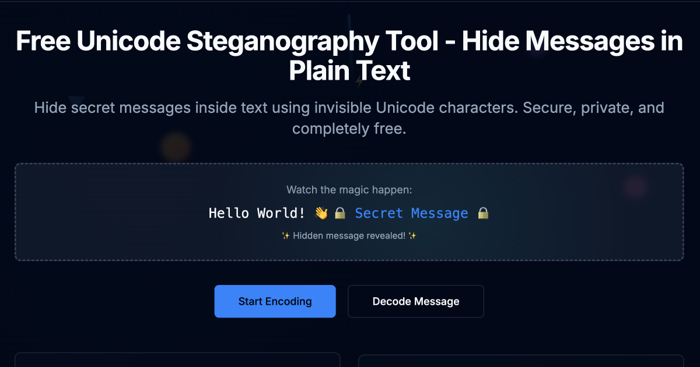

# Stegmoji 🔒

<div align="center">
  
</div>

A modern web application for Unicode steganography - hiding secret messages inside text using invisible Unicode characters.

## Features

- **Three Embedding Modes**: Tail, Interleaved, and ZWJ-aware embedding
- **Compression**: DEFLATE compression to fit more data in shorter texts
- **Encryption**: AES-GCM encryption with PBKDF2 key derivation
- **Unicode Analysis**: Comprehensive text analysis and visualization
- **Privacy-First**: All processing happens locally in your browser
- **Modern UI**: Built with Next.js, Tailwind CSS, and shadcn/ui components
- **Dark Mode**: Default dark theme with light/dark mode toggle
- **Responsive Design**: Optimized for mobile and desktop devices

## Quick Start

### Prerequisites

- Node.js 18+ 
- pnpm (recommended) or npm

### Installation

1. **Clone the repository**
   ```bash
   git clone https://github.com/chinmay29hub/stegmoji.git
   cd stegmoji
   ```

2. **Install dependencies**
   ```bash
   pnpm install
   ```

3. **Start the development server**
   ```bash
   pnpm dev
   ```

4. **Open your browser**
   Navigate to [http://localhost:3000](http://localhost:3000)

## Usage

### Encoding Messages

1. Go to the **Encode** tab
2. Enter your secret message in the "Hidden Message" field
3. Enter cover text in the "Cover Text" field
4. Choose embedding mode:
   - **Tail**: Appends data at the end (unlimited capacity)
   - **Interleaved**: Inserts between codepoints (limited by text length)
   - **ZWJ-aware**: Inserts between grapheme clusters (preserves emoji)
5. Optionally enable compression and/or encryption
6. Click "Encode Message" to generate the steganographic text

### Decoding Messages

1. Go to the **Decode** tab
2. Paste the encoded text
3. Choose detection mode (Auto-detect recommended)
4. Enter passphrase if the message was encrypted
5. Click "Decode Message" to extract the hidden content

### Analyzing Text

1. Go to the **Scan** tab
2. Paste any text to analyze
3. View detailed Unicode analysis including:
   - Invisible character detection
   - Steganography indicators
   - Grapheme cluster breakdown
   - Normalization effects

## Technical Details

### Steganography Method

Stegmoji uses Unicode Variation Selectors to embed data:
- `U+FE0E` (VS15) represents bit 0
- `U+FE0F` (VS16) represents bit 1

These characters are invisible and don't affect text rendering.

### Security Features

- **Compression**: DEFLATE algorithm reduces payload size
- **Encryption**: AES-GCM with 256-bit keys
- **Key Derivation**: PBKDF2 with SHA-256 (100,000 iterations)
- **Authentication**: GCM provides built-in message authentication

### Embedding Modes

1. **Tail Mode**: Appends all variation selectors at the end
   - ✅ Unlimited capacity
   - ⚠️ Easily detectable by scanning text endings

2. **Interleaved Mode**: Inserts one bit after each Unicode codepoint
   - ✅ Distributes data throughout text
   - ⚠️ Limited by number of characters

3. **ZWJ-Aware Mode**: Inserts one bit after each grapheme cluster
   - ✅ Preserves emoji and complex Unicode sequences
   - ⚠️ Limited by number of visual characters

## Deployment

### Deploy to Vercel

1. **Push to GitHub**
   ```bash
   git add .
   git commit -m "Initial commit"
   git push origin main
   ```

2. **Deploy with Vercel**
   - Go to [vercel.com](https://vercel.com)
   - Import your GitHub repository
   - Deploy with default settings (no environment variables needed)
   - Your app will be available at: `https://your-project-name.vercel.app`

3. **Custom Domain** (optional)
   - Add your domain in Vercel dashboard
   - Configure DNS records as instructed

### Alternative Deployment

The app can be deployed to any platform that supports Next.js:
- Netlify
- Railway
- Render
- Self-hosted with Docker

## Development

### Project Structure

```
stegmoji/
├── app/                    # Next.js App Router pages
│   ├── layout.jsx          # Root layout with navigation
│   ├── page.jsx            # Home page
│   ├── encode/page.jsx     # Encoding interface
│   ├── decode/page.jsx     # Decoding interface
│   ├── scan/page.jsx       # Unicode analysis
│   ├── about/page.jsx      # Documentation
│   └── sitemap.xml/        # SEO sitemap
├── components/             # React components
│   ├── ui/                 # Reusable UI components
│   ├── theme-provider.jsx  # Dark/light mode provider
│   └── client-layout.jsx   # Client-side layout
├── lib/                    # Core functionality
│   ├── steganography.js   # Main steganography logic
│   ├── compression.js     # DEFLATE compression
│   ├── encryption.js      # AES-GCM encryption
│   ├── unicode.js         # Unicode utilities
│   ├── use-dark-mode.js   # Dark mode hook
│   └── utils.js           # Helper functions
├── __tests__/              # Comprehensive test suite
├── .github/                # GitHub templates and workflows
└── public/                 # Static assets
```

### Key Dependencies

- **Next.js 14**: React framework with App Router
- **Tailwind CSS**: Utility-first CSS framework with dark mode support
- **Radix UI**: Accessible component primitives
- **Framer Motion**: Smooth animations and transitions
- **grapheme-splitter**: Unicode grapheme cluster splitting
- **pako**: DEFLATE compression library
- **Web Crypto API**: Browser-native encryption
- **Jest**: Testing framework with comprehensive test coverage
- **ESLint**: Code linting and formatting

### Browser Compatibility

- Chrome 60+
- Firefox 55+
- Safari 11+
- Edge 79+

Requires modern browsers with Web Crypto API support.

## Security Considerations

### Limitations

- **Platform Compatibility**: Some platforms strip invisible Unicode characters
- **Detection**: Steganography can be detected by analyzing character patterns
- **Normalization**: Text normalization may remove hidden data
- **Not Cryptographically Secure**: This is steganography, not cryptography

### Best Practices

1. **Test on Target Platform**: Verify that invisible characters survive copy-paste
2. **Use Strong Passphrases**: For encrypted messages, use long, random passphrases
3. **Be Aware of Detection**: Hidden data can be discovered through analysis
4. **Consider Legal Implications**: Ensure compliance with local laws

## Contributing

We welcome contributions! Please see our [Contributing Guide](CONTRIBUTING.md) for details on how to get started.

### Quick Start for Contributors

1. **Fork the repository** and clone your fork
2. **Create a feature branch**: `git checkout -b feature/your-feature-name`
3. **Install dependencies**: `pnpm install`
4. **Start development**: `pnpm dev`
5. **Make your changes** and test them
6. **Submit a pull request**

### Types of Contributions

- 🐛 **Bug fixes** - Fix issues and improve stability
- ✨ **New features** - Add new functionality
- 📚 **Documentation** - Improve docs and examples
- 🧪 **Tests** - Add or improve test coverage (currently 95%+)
- 🚀 **Performance** - Optimize code and improve speed
- 🎨 **UI/UX** - Improve user interface and experience
- ♿ **Accessibility** - Make the app more accessible
- 🔒 **Security** - Fix security vulnerabilities
- 🌙 **Theme improvements** - Enhance dark/light mode experience

### Development Setup

```bash
# Clone your fork
git clone https://github.com/YOUR_USERNAME/stegmoji.git
cd stegmoji

# Install dependencies
pnpm install

# Start development server
pnpm dev

# Run tests with coverage
pnpm test --coverage

# Run linter
pnpm lint

# Build for production
pnpm build
```

### Getting Help

- 📖 **Documentation**: Check our [Contributing Guide](CONTRIBUTING.md)
- 💬 **Discussions**: Use GitHub Discussions for questions
- 🐛 **Issues**: Create an issue for bugs or feature requests
- 🔒 **Security**: See [SECURITY.md](SECURITY.md) for security issues

### Code of Conduct

This project follows the [Contributor Covenant Code of Conduct](CODE_OF_CONDUCT.md). By participating, you agree to uphold this code.

## License

This project is licensed under the MIT License - see the [LICENSE](LICENSE) file for details.

## Disclaimer

This tool is for educational and legitimate purposes only. Users are responsible for complying with applicable laws and regulations. The authors are not responsible for any misuse of this software.

## Performance

This application is optimized for performance:
- **No obfuscation overhead** - Clean, fast JavaScript
- **Optimized builds** - Source maps disabled in production
- **Efficient algorithms** - Fast steganography operations
- **Modern browser APIs** - Native Web Crypto and compression
- **Dark mode optimization** - Instant theme switching without flash
- **Responsive animations** - Smooth transitions with Framer Motion

## Support

### Community Support

- 🐛 **Bug Reports**: Use our [bug report template](.github/ISSUE_TEMPLATE/bug_report.yml)
- ✨ **Feature Requests**: Use our [feature request template](.github/ISSUE_TEMPLATE/feature_request.yml)
- ❓ **Questions**: Use our [question template](.github/ISSUE_TEMPLATE/question.yml)
- 💬 **Discussions**: Use GitHub Discussions for general questions
- 📖 **Documentation**: Check the About page and source code

### Security Issues

- 🔒 **Security Vulnerabilities**: See [SECURITY.md](SECURITY.md) for reporting security issues
- 📧 **Private Reporting**: Email chinmaysonawane57@gmail.com for sensitive issues

### Contributing

- 📝 **Contributing Guide**: See [CONTRIBUTING.md](CONTRIBUTING.md) for detailed guidelines
- 🤝 **Code of Conduct**: See [CODE_OF_CONDUCT.md](CODE_OF_CONDUCT.md) for community guidelines
- 🔄 **Pull Requests**: Use our [PR template](.github/pull_request_template.md)

---

**Stegmoji** - Hide messages in plain sight with Unicode steganography 🔒

*Live Demo: [https://chinmay29hub-stegmoji.vercel.app](https://chinmay29hub-stegmoji.vercel.app)*